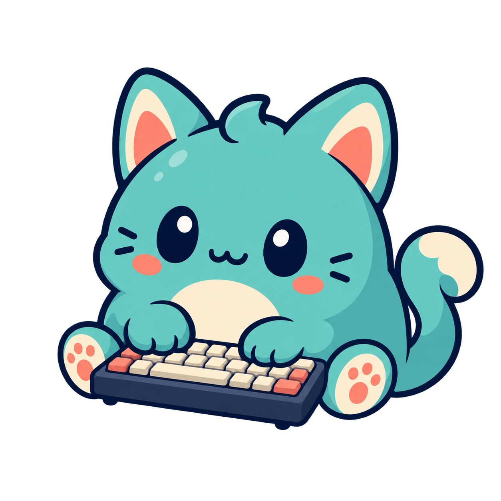

# Typing Pet for macOS

키를 누를 때마다 원하는 펫 이미지 중 하나를 보여 주는 네이티브 macOS 메뉴 막대 앱입니다.



Windows용 [swoonqx/TypingPet](https://github.com/swoonqx/TypingPet)에서 아이디어를 얻어 macOS용으로 새로 구현한 비공식 프로젝트입니다. 원본 프로젝트의 소스 코드와 이미지 자산은 포함하지 않습니다.

## 다운로드

GitHub Releases에서 `TypingPet-macOS-arm64.zip`을 내려받아 압축을 풀고 `TypingPet.app`을 Applications 폴더로 옮깁니다.

현재 공개 빌드는 Apple Silicon 전용 프리릴리스입니다. Apple Developer ID 공증 전까지는 Gatekeeper가 개발자 확인 경고를 표시할 수 있습니다. 소스에서 직접 빌드할 수도 있습니다.

## 동작

- 기본 상태에서는 `pet-idle.png`를 표시합니다.
- 전역 키 입력이 발생하면 활성 이미지 세트의 반응 이미지 중 직전 이미지와 다른 하나를 무작위로 표시합니다.
- 특정 키 또는 `⌃⌥⇧⌘` 조합에 전용 이미지를 지정할 수 있습니다. 정확히 일치하는 규칙이 무작위 반응보다 우선합니다.
- 위치 잠금을 끄면 펫을 직접 드래그해 옮길 수 있습니다. 빠르게 놓으면 속도에 따라 살짝 미끄러진 뒤 부드럽게 멈춥니다.
- 펫에 마우스를 올리면 살짝 커지고, 잡아 끄는 동안에는 눌리는 듯 작아지는 스프링 효과가 적용됩니다.
- 설정에서 상시 투명도와 호버 시 투명도를 각각 조절할 수 있습니다. 기본값은 상시 100%, 호버 시 30%이며 커서 진입·이탈 즉시 적용됩니다. 조작 버튼은 선명하게 유지됩니다.
- `위치 잠금 중 마우스 피하기`를 켜면 클릭 통과 상태의 펫이 가까워지는 커서를 감지해 화면 안에서 부드럽게 자리를 비킵니다.
- 펫에 마우스를 올리면 `×`와 크기 조절 핸들이 나타납니다. `×`는 펫만 숨기며 메뉴 막대의 `펫 다시 표시`로 복원할 수 있습니다.
- 우측 상단 핸들을 드래그하면 이미지 비율을 유지하면서 크기가 바뀌며 설정 창의 크기 값과 동기화됩니다.
- 0.75초 동안 입력이 없으면 idle 이미지로 돌아갑니다.
- 일반 입력 문자는 읽거나 저장하지 않습니다. 키 반응 규칙에는 선택한 물리 키 코드와 보조 키 조합만 로컬에 저장합니다.

## 설정 창

메뉴 막대의 발바닥 아이콘에서 `설정`을 선택합니다.

- `일반`: 펫 크기, 상시/호버 투명도, 통통 튀는 정도(끔/약하게/보통/강하게), 항상 위, 위치 잠금/마우스 피하기, 로그인 자동 실행, 입력 모니터링 권한 상태
- `갤러리`: 여러 이미지 세트 추가, 미리보기, 선택/적용, 이름 변경, 목록에서 제거
- `키 반응`: 이미지와 특정 키 또는 키 조합을 연결하고 삭제

## 이미지 교체

설정 창의 `갤러리` 탭을 사용합니다. 기존 메뉴 막대의 `이미지` 빠른 메뉴도 계속 사용할 수 있습니다.

- `대기 이미지 변경…`: 입력이 없을 때 표시할 이미지 1장을 선택합니다.
- `반응 이미지 교체…`: 키 입력 때 무작위로 표시할 이미지를 여러 장 선택합니다. 개수 제한은 없습니다.
- `이미지 폴더 가져오기…`: 이미지 세트를 갤러리에 추가하고 바로 적용합니다.
- `기본 이미지로 복원`: 앱에 포함된 기본 세트를 다시 활성화합니다. 추가한 갤러리 세트는 유지됩니다.

가져온 세트는 `~/Library/Application Support/TypingPet/Images/Sets`에, 특정 키 반응 이미지는 `~/Library/Application Support/TypingPet/KeyReactions`에 복사되므로 원본을 이동하거나 삭제해도 계속 사용할 수 있습니다.

### 폴더 세트 규칙

- `idle.*` 또는 `pet-idle.*` 파일이 있으면 대기 이미지로 사용합니다.
- 나머지 지원 이미지는 모두 키 입력용 이미지로 사용합니다.
- 대기 이미지가 없으면 정렬상 첫 이미지를 대기 이미지로 사용합니다.
- 반응 이미지가 한 장뿐이어도 사용할 수 있으며, 폴더에 이미지가 한 장만 있으면 대기/반응에 함께 사용합니다.
- 파일명, 이미지 크기와 가로세로 비율은 자유입니다.
- PNG, APNG, JPG, JPEG, GIF, TIFF, HEIC, HEIF, WebP를 지원합니다.
- 서로 다른 비율의 반응 이미지는 대기 이미지 기준 캔버스 안에 비율을 유지해 표시합니다.

## 빌드

요구 사항: Apple Silicon Mac, macOS 13 이상, Swift 6/Xcode Command Line Tools.

```shell
swift test
./scripts/build_app.sh
open dist/TypingPet.app
```

빌드 스크립트는 Keychain에서 `Developer ID Application`, `Apple Development`, 임시 서명 순으로 사용합니다. 특정 인증서를 쓰려면 `CODE_SIGN_IDENTITY` 환경 변수로 지정할 수 있습니다.

공개 배포용 공증에는 Apple Developer Program과 `Developer ID Application` 인증서가 필요합니다. 인증서를 준비한 뒤 `xcrun notarytool store-credentials typingpet-notary`를 한 번 실행하고 다음 스크립트를 사용합니다.

```shell
CODE_SIGN_IDENTITY="Developer ID Application: 이름 (TEAMID)" ./scripts/build_app.sh
./scripts/notarize_release.sh
```

처음 실행하면 macOS의 입력 모니터링 권한을 허용해야 합니다. `시스템 설정 열기`를 누르면 작은 안내창이 항상 위에 표시되고, 열린 시스템 설정 창 옆을 따라갑니다. 안내창의 `TypingPet.app` 아이콘을 입력 모니터링 목록으로 드래그하고 스위치를 켜세요. 드래그가 동작하지 않으면 목록 아래의 `+` 버튼으로 앱을 직접 선택할 수 있습니다.

권한을 안정적으로 유지하려면 압축을 푼 앱을 먼저 Applications 폴더로 옮긴 뒤 실행하는 것을 권장합니다. 권한이 허용되면 앱이 자동으로 키 입력 감지를 다시 연결하고 안내창을 닫습니다. 메뉴 막대의 `키 입력 감지` 항목에서 현재 상태를 확인할 수 있습니다.

## 개인정보 보호

- 일반 입력 문자를 저장하거나 네트워크로 전송하지 않습니다.
- 특정 키 반응에는 사용자가 등록한 물리 키 코드와 보조 키 조합만 로컬에 저장합니다.
- 앱 자체에는 네트워크 통신 기능이 없습니다.

## 라이선스

- 소스 코드: [MIT](LICENSE)
- 기본 키보드 고양이 자산: [CC0 1.0](ASSET_LICENSE.md)

기본 고양이 이미지는 이 저장소를 위해 AI로 새로 생성한 더미 자산입니다. 사용자가 가져온 이미지의 권리는 각 이미지의 원저작자에게 있습니다.
